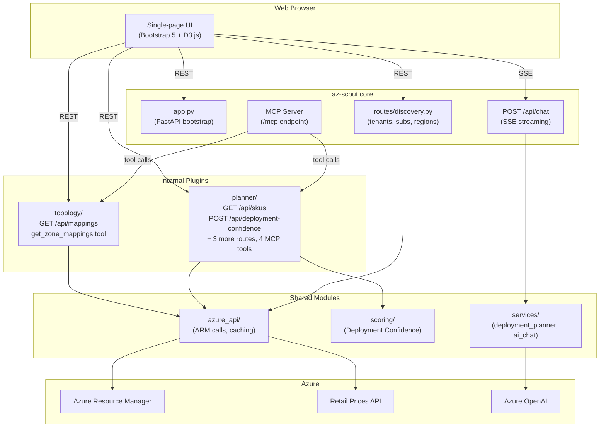
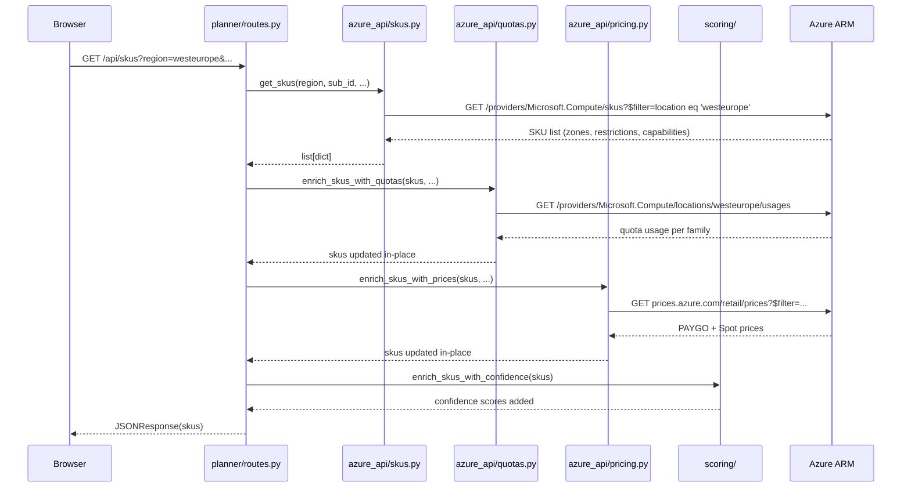
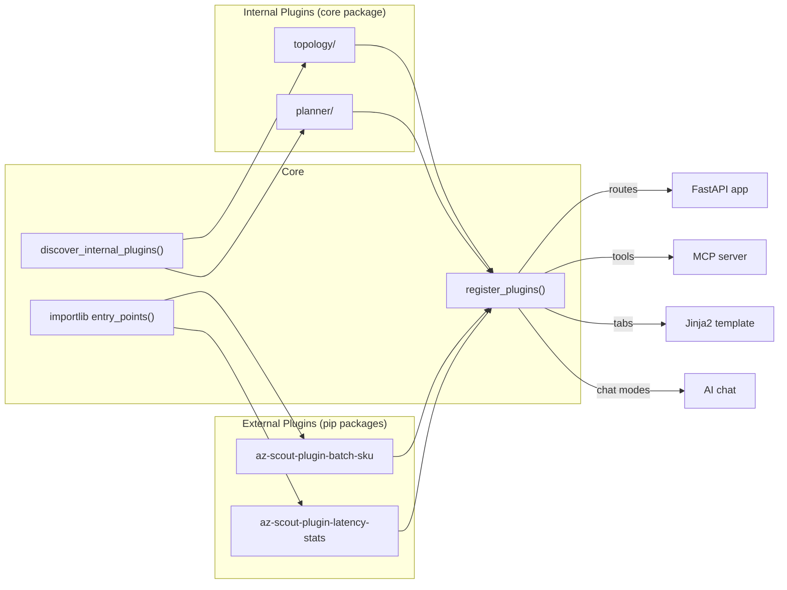

# Architecture

This page describes az-scout's internal architecture — useful for contributors and plugin developers.

---

## System Overview



---

## Request Flow: SKU Availability

How a `GET /api/skus?region=westeurope&subscriptionId=xxx&includePrices=true` request flows through the system:



---

## Internal Plugin Architecture

Both built-in features (AZ Topology, Deployment Planner) and external plugins use the same `AzScoutPlugin` protocol:



**Internal vs external plugins:**

| Aspect | Internal | External |
|--------|----------|----------|
| Location | `src/az_scout/internal_plugins/` | Separate pip package |
| Route prefix | `/api` (backward-compatible) | `/plugins/{name}` |
| Static prefix | `/internal/{name}/static` | `/plugins/{name}/static` |
| Discovery | `discover_internal_plugins()` | `importlib.metadata.entry_points` |
| Plugin Manager | Shows "built-in" badge | Install / uninstall / update |

---

## Module Map

```
src/az_scout/
├── app.py                    # FastAPI bootstrap (220 lines)
├── logging_config.py         # Unified coloured logging
├── cli.py                    # Click CLI (web + mcp)
├── mcp_server.py             # MCP server (discovery tools only)
├── plugin_api.py             # AzScoutPlugin protocol + dataclasses
├── plugins.py                # Plugin discovery + registration
├── plugin_manager/           # Plugin install/validate/uninstall (7 modules)
├── azure_api/                # Azure ARM helpers (stable API: __all__ + PLUGIN_API_VERSION)
├── scoring/                  # Deployment Confidence Score
├── services/
│   ├── ai_chat/              # AI chat (6 modules)
├── models/                   # Pydantic models
├── routes/
│   ├── __init__.py            # Plugin manager API
│   └── discovery.py           # Tenants, subscriptions, regions
├── internal_plugins/
│   ├── topology/              # AZ Topology tab
│   └── planner/               # Deployment Planner tab
├── static/                    # Core JS/CSS/images
└── templates/                 # Jinja2 template
```
