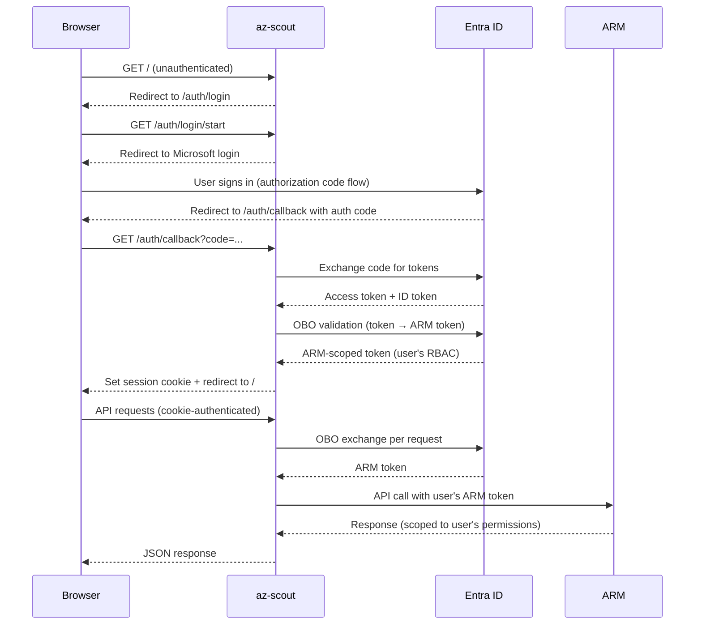

# On-Behalf-Of (OBO) Authentication

When deploying az-scout for **multiple users**, the On-Behalf-Of (OBO) flow lets each user sign in with their own Microsoft account. Azure ARM API calls are made with the **user's RBAC permissions** instead of the app's identity — so each user only sees the subscriptions and resources they have access to.

!!! info "When do I need OBO?"
    - **Single user / local dev**: Not needed. `az login` or managed identity is sufficient.
    - **Shared instance** (e.g. Azure Container Apps): **Recommended.** Each user signs in and sees only their own resources.

## How it works



## Single-tenant-per-session model

Each login session is scoped to a **single tenant** — the one the user authenticated against. This ensures OBO always succeeds (the token was issued by the same tenant). To access a different tenant, the user signs out and signs in again targeting that tenant.

The login page offers two options:

- **Sign in with your account** — uses `organizations` authority (Microsoft picks the tenant based on the user's account)
- **Target a specific tenant** — user enters a tenant domain or ID (e.g. `contoso.com`) to sign in directly to that tenant

## Setup

### 1. Create an App Registration

Create a multi-tenant App Registration in Entra ID:

```bash
az login

az ad app create \
  --display-name "az-scout" \
  --sign-in-audience "AzureADMultipleOrgs" \
  --query "{appId: appId, objectId: id}" -o json
```

Note the `appId` — this is your **Client ID**.

### 2. Add a Web redirect URI

In the [Azure Portal](https://portal.azure.com) → **App registrations** → your app → **Authentication**:

1. Click **Add a platform** → **Web**
2. Add redirect URIs:
    - Local dev: `http://localhost:5001/auth/callback`
    - Production: `https://your-app.azurecontainerapps.io/auth/callback`

!!! warning "Use Web, not SPA"
    The redirect URI type **must** be "Web" (not "Single-page application"). az-scout uses a server-side authorization code flow.

### 3. Expose an API scope

In **Expose an API**:

1. Set the **Application ID URI** to `api://<CLIENT_ID>`
2. Click **Add a scope**:
    - Scope name: `access_as_user`
    - Who can consent: **Admins and users**
    - Admin consent display name: `Access Azure resources as user`
    - Admin consent description: `Allow az-scout to access Azure resources on behalf of the signed-in user`
3. Click **Add scope**

### 4. Pre-authorize Azure CLI (optional, for MCP)

To allow MCP clients to authenticate via `az account get-access-token`:

```bash
SCOPE_ID=$(az ad app show --id <CLIENT_ID> \
  --query "api.oauth2PermissionScopes[0].id" -o tsv)

az rest --method PATCH \
  --url "https://graph.microsoft.com/v1.0/applications(appId='<CLIENT_ID>')" \
  --body "{\"api\":{\"preAuthorizedApplications\":[{\"appId\":\"04b07795-8ddb-461a-bbee-02f9e1bf7b46\",\"delegatedPermissionIds\":[\"$SCOPE_ID\"]}]}}"
```

### 5. Create a client secret

In **Certificates & secrets** → **New client secret**:

1. Add a description (e.g. `az-scout OBO`)
2. Set expiration
3. Copy the **Value** (not the ID) — this is your **Client Secret**

### 6. Grant ARM API permission

In **API permissions**:

1. Click **Add a permission** → **Azure Service Management** → **Delegated permissions**
2. Check `user_impersonation`
3. Click **Grant admin consent** (requires Global Administrator)

### 7. (Optional) Create Admin App Role

To restrict plugin management to specific users:

```bash
az rest --method PATCH \
  --url "https://graph.microsoft.com/v1.0/applications(appId='<CLIENT_ID>')" \
  --body '{"appRoles":[{"allowedMemberTypes":["User"],"displayName":"Admin","description":"Can manage plugins","id":"a1b2c3d4-e5f6-7890-abcd-ef1234567890","isEnabled":true,"value":"Admin"}]}'
```

Then assign the role to users via **Enterprise Applications** → your app → **Users and groups**.

## Configuration

Set these environment variables on your az-scout instance:

| Variable | Description | Required |
|----------|-------------|----------|
| `AZ_SCOUT_CLIENT_ID` | App Registration Client (Application) ID | **Yes** |
| `AZ_SCOUT_CLIENT_SECRET` | App Registration Client Secret | **Yes** |
| `AZ_SCOUT_TENANT_ID` | Home tenant ID of the App Registration | Optional |

```bash
export AZ_SCOUT_CLIENT_ID="your-client-id"
export AZ_SCOUT_CLIENT_SECRET="your-secret"
export AZ_SCOUT_TENANT_ID="your-tenant-id"

az-scout web
```

When these variables are set, az-scout:

- Redirects to a **login page** when unauthenticated
- Validates OBO at login — blocks session creation if ARM access fails
- Uses the signed-in user's RBAC permissions for all ARM calls
- Falls back to `DefaultAzureCredential` in CLI mode (`az-scout chat`, `az-scout mcp`)

## Admin consent

Each tenant where users will access az-scout needs admin consent **once**. The first user from a new tenant will see the consent prompt on the login page with:

- A **"Grant Admin Consent"** button (opens the consent URL)
- A **"Copy link"** button (for sending to the tenant admin)

After consent is granted, users from that tenant can sign in normally.

## Role-based access control

The `Admin` App Role controls who can manage plugins:

- **Admin role** is only honored from the **home tenant** — other tenants' role assignments are ignored
- **Plugin management** (install/uninstall/update) requires the Admin role
- **Non-admins** see a read-only UI with the plugin manager hidden
- When OBO is not enabled, all users are treated as admin (single-user mode)

## MCP authentication

When OBO is enabled, MCP clients must also authenticate. For VS Code:

```json
{
    "inputs": [
        {
            "type": "promptString",
            "id": "az-scout-token",
            "description": "Bearer token",
            "password": true
        }
    ],
    "servers": {
        "az-scout": {
            "url": "http://127.0.0.1:5001/mcp",
            "type": "http",
            "headers": {
                "Authorization": "Bearer ${input:az-scout-token}"
            }
        }
    }
}
```

Get the token:

```bash
az account get-access-token \
  --resource api://<CLIENT_ID> \
  --query accessToken -o tsv
```

!!! note "First-time consent for Azure CLI"
    If you get a consent error, run:
    ```bash
    az login --scope "api://<CLIENT_ID>/.default"
    ```
    Then retry the `get-access-token` command.

## Security considerations

- **No app-level ARM access**: When OBO is enabled, `DefaultAzureCredential` is **never** used for web requests. All ARM calls require a user token.
- **OBO validation at login**: OBO is tested before creating a session — failures (consent, MFA, etc.) are shown on the login page, not the main app.
- **Per-user isolation**: Each user's token is exchanged independently. Users only see resources matching their RBAC permissions.
- **Single-tenant sessions**: Each session is scoped to the login tenant — no cross-tenant OBO failures.
- **CSRF protection**: OAuth state uses cryptographic nonces (10-min expiry, single-use).
- **Signed cookies**: Session IDs are HMAC-SHA256 signed with the client secret.
- **HTTP-only cookies**: Session cookies are not accessible from JavaScript.
- **CLI fallback**: `az-scout chat` and `az-scout mcp --stdio` use `DefaultAzureCredential`.

## Troubleshooting

| Symptom | Cause | Fix |
|---------|-------|-----|
| "Admin consent required" on login page | Tenant hasn't consented to the app | Click "Grant Admin Consent" or send the link to a tenant admin |
| "Account not found in this tenant" | User doesn't exist in the specified tenant | Use "Sign in with your account" instead, or enter the correct tenant |
| "Multi-factor authentication required" | Tenant CA policy requires MFA | Try signing in again — MFA should be triggered during login |
| "Session expired" | Token expired | Sign in again |
| Empty subscription list | User lacks Reader RBAC in this tenant | Assign at least Reader on a subscription |
| MCP tool returns "Authentication required" | Missing or expired Bearer token | Get a fresh token via `az account get-access-token` |
| Plugin manager not visible | User doesn't have the Admin App Role | Assign the Admin role in the home tenant's Enterprise Application |
